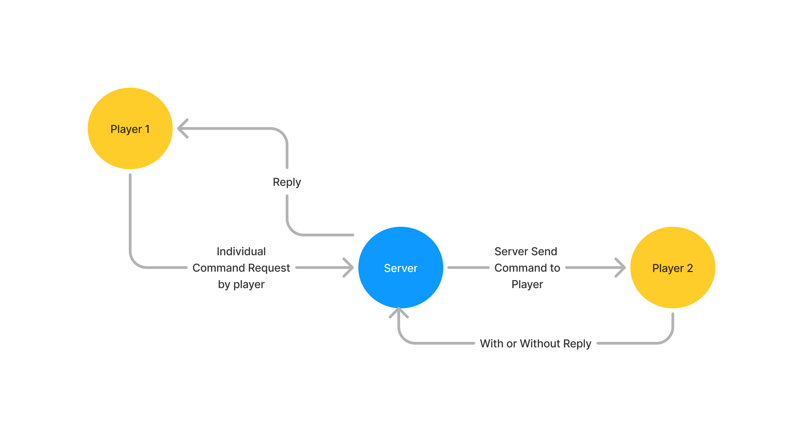
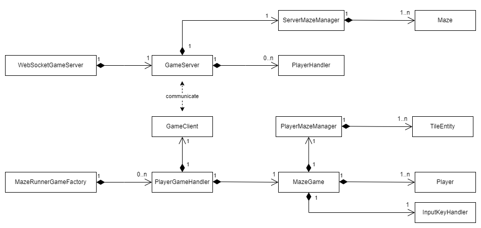
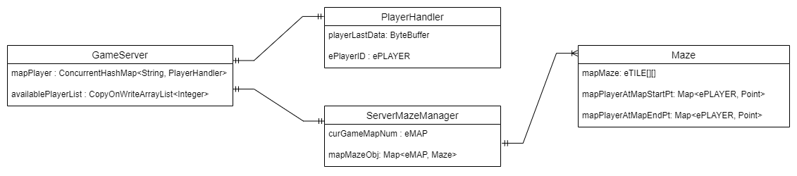
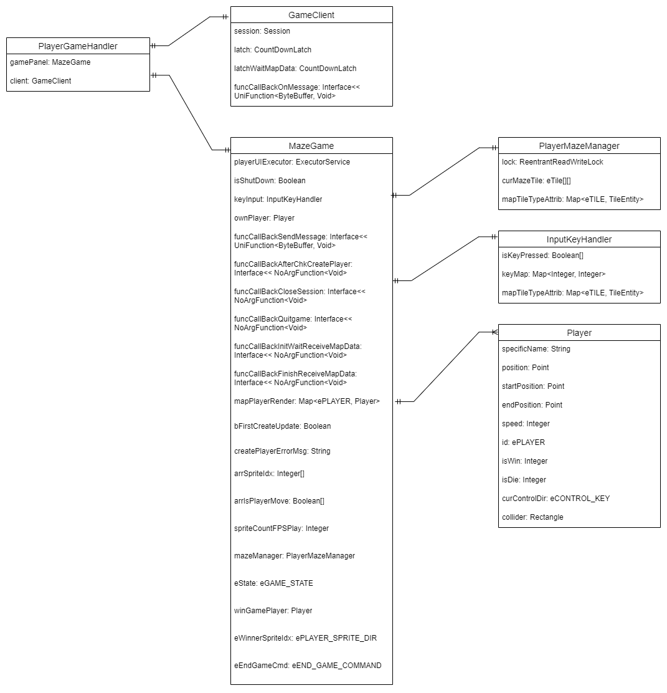

# Project Design Document

## Section 1 - Project Description

### 1.1 Project

A-Maze-ing Runner

### 1.2 Description

    The project is a 2D real-time streaming maze runner game. Multiple players run in a maze through different complexity levels to reach the finish point before opponents. Players need to overcome obstacles, traps, puzzling shortcut or collect widgets for the advantages to against other players.

### 1.3 Revision History

| Date | Comment | Author|
|------|---------|-------|
|3 Aug 2024| 1st Revision 23 x 23 Map Gaming, Max 4 players, basic movement, no widgets, no traps| Chow, Tsz Chun Samuel|
|17 Aug 2024| 2nd Revision Added Unit Test, some bugs resolved| Chow, Tsz Chun Samuel|
|||

 

## Section 2 - Overview

### 2.1 Purpose

    The project focuses on providing a real-time streaming game play with low latency and targeting for game or maze lovers to compete and solve the maze.

### 2.2 Scope

<h4><u>
    Maze Generation
</u></h4>

    Maze is generated through a map file when games started. The map file is a text file storing numbers for object identification to construct the maze. The maze can be a perfect maze or braid maze.

<h4><u>
    User Interface
</u></h4>

    Real-time rendering of the maze. Player uses keyboard to control the character movement up, down, left and right. The game currently supports up to maximum 4 players at a time

<h4><u>
    Synchronization
</u></h4>

    Dynamic objects in the game are synchronized as well as the players positions and actions.

### 2.3 Requirements

#### 2.3.1 Functional Requirements

|  | Requirement(s) |
|------|------|
|R1| The system shall auto detect if the server is running or not when player game started. |
|R2| The system shall auto assign player id (1 to 4) to the user who joins and request game start accordingly.|
|R3| Any player quit the game should not affect the gaming availability and experience. |
|R4| Once the number of the game board players is less than the maximum player design. It allows players to join any time|
|R5| Player should be able to control the game character by keyboard.|

#### 2.3.2 Non-Functional Requirements

<h4><u>Performance</u></h4>

    Design should provide 60 FPS refresh rate. The system is designed with scalable maximum number of players point of arts.

<h4><u>Reliability (availability, error handling)</u></h4>

    Each player gaming loop should have at least 1ms interval in purpose of CPU resources saving.

#### 2.3.3 Technical Requirements

    Each player gaming loop should have at least 1ms interval in purpose of CPU resources saving.

||Descrptions|
|---|---|
|Hardware|The system shall run on servers with at least 4GB of RAM and 1 CPU for a 20 players gaming sizes.|
|Software|The system shall be developed using Java and run with a WebSocket environment.|

#### 2.3.4 Estimates

|#|Descriptions|Hrs. Est.|
|-|-|-|
|1|Create an emtpy UI board with a simple colored box with keyboard control|3 hrs|
|2|Create Maven project with Jakarta WebSocketServer and Client, text simple communication|3 hrs|
|3|Create each player client WebSocket handler|1 hr|
|4|Test communication to server with object information display|1 hr|
|5|Create data format center, design the player object, and design the player object information in terms of byte format style|3 hrs|
|6|Introduce multiplayer instance with player factory|2 hrs|
|7|Broadcasting players’ information and rendering all players’ character in all player’s user interface|3 hrs|
|8|Characters, maze objects sprite design|3 hrs|
|9|Maze map design and rendering|3 hrs|
|10|Maze object collider algorithm|3 hrs|
|11|Game finish sub-window and restart handling|3 hrs|
||TOTAL:|28 hrs|

 

## Section 3 - System Architecture

### 3.1 Overview

    

    The system introduces communication between one game WebSocketServer and multiple WebSocketClient players. The data would be transmitted through the byte binary format in a low latency design. Meanwhile, DataFormatCenter is aided to convert the binary data back to useful object information for the MazeGame object to proceed the game logic and render the UI. On the other hand, MazeGame would capture user input for the character control at the same time transferring back the updated player information to the WebSocketServer in the binary format.

 

    

    

    In the global point of view, any player information updated would turn into binary format and send to the server. Any player client’s updated information received at the WebSocketServer would be broadcasted to the rest of the players. Thus, this keeps every client players would have the updated opponent players’ information such as position, alive status etc. Apart from player’s data broadcasting, individual command requested by player or server commands to player are also available and being held in the system. Individual request example would be like map requesting by players, while the server commands would be as game ending with results. 

### 3.2 Architectural Diagrams

<h3><u>Class Diagram</u></h3>

<h4><u>Overview :</u></h4>

    

<h4><u>Detailed :</u></h4>

    

 

## Section 4 - Data Dictionary

### Server Side

 
<h4><u>GameServer Class</u></h4>

> |Field|Notes|Type|
> |-|-|-|
> | mapPlayer           | Session id to PlayerHandler Object | ConcurrentHashMap&lt;String, PlayerHandler&gt; |
> | availablePlayerList | List to store available player id   | CopyOnWriteArrayList&lt;Integer&gt;|

<h4><u>PlayerHandler Class</u></h4>

> |Field|Notes|Type|
> |-|-|-|
> | playerLastData| Binary data storing last received player information | ByteBuffer|
> | ByteBuffer | Enum player ID | ePLAYER (enum)|
> |session|	WebSocket client connected session|	Session|

<h4><u>ServerMazeManager Class</u></h4>

> | Field         | Notes                           | Type                  |
> |---------------|---------------------------------|-----------------------|
> | mapMazeObj    | Maze id to the Maze Object      | Map&lt;eMAP, Maze&gt; |
> | curGameMapNum | Current gaming Maze id          | eMAP (enum)           |

<h4><u>Maze  Class</u></h4>

> | Field                       | Notes                                                      | Type                   |
> |-----------------------------|------------------------------------------------------------|------------------------|
> | mapMaze                    | Maze map storing integer numbers (eTILE) which representing the maze design | eTILE[][]             |
> | mapPlayerAtMapStartPt      | Player id starting position x, y                            | Map<ePLAYER, Point>    |
> | mapPlayerAtMapEndPt        | Player id finishing position x, y                           | Map<ePLAYER, Point>    |

<h4><u>MazeData Class</u></h4>

> | Field    | Notes                                                       | Type                       |
> |----------|-------------------------------------------------------------|----------------------------|
> | mapTile  | A map storing integer numbers (eTILE) which representing the maze design | eTILE[][] (enum array)     |
> | startPt  | A Point object data for start point information             | Point                      |
> | endPt    | A Point object data for start point information             | Point                      |

 

### Client Side

<h4><u>PlayerGameHandler Class</u></h4>

> | Field      | Notes                 | Type       |
> |------------|-----------------------|------------|
> | gamePanel  | MazeGame Object       | MazeGame   |
> | client     | GameClient Object     | GameClient |

<h4><u>GameClient Class</u></h4>

> | Field                   | Notes                                                                 | Type                            |
> |-------------------------|-----------------------------------------------------------------------|---------------------------------|
> | session                 | WebSocket server connected session                                    | Session                         |
> | latch                   | Count down latch for connection and player creation                   | CountDownLatch                  |
> | latchWaitMapData        | Count down latch for waiting maze map data                            | CountDownLatch                  |
> | funcCallBackOnMessage   | A call back method to run when receiving message from server Used to pass server data to the MazeGame object          | Interface UniFunction&lt;ByteBuffer, Void&gt; |

<h4><u>MazeGame Class</u></h4>

> | Field                               | Notes                                                                                                    | Type                                    |
> |-------------------------------------|----------------------------------------------------------------------------------------------------------|-----------------------------------------|
> | playerUIExecutor                    | Executor to start thread for gaming UI panel                                                             | ExecutorService                         |
> | isShutDown                          | Flag for shutdown process quitting the loop                                                              | Boolean                                 |
> | keyInput                            | A InputKeyHandler object                                                                                 | InputKeyHandler                         |
> | ownPlayer                           | The own playing Player object                                                                            | Player                                  |
> | funcCallBackSendMessage             | A call back method to call when sending data to server Assigned in PlayerGameHandler class with GameClient method sendMessage()                                                     | Interface UniFunction&lt;ByteBuffer, Void&gt; |                                  |
> | funcCallBackAfterChkCreatePlayer    | A call back method to call after success created Player object Assigned in PlayerGameHandler class with GameClient method waitCreatePlayerCheckedOneChkPt()                                           | Interface NoArgFunction&lt;Void&gt;        |
> | funcCallBackCloseSession            | A call back method to call during close Assigned in PlayerGameHandler class with GameClient method closeConnection()                                                                  | Interface NoArgFunction&lt;Void&gt;        |             |
> | funcCallBackQuitGame                | A call back method to call in the game to call a command to quit the game and UI Assigned in PlayerGameHandler class in GameClient method WindowCloseHandle()                         | Interface NoArgFunction&lt;Void&gt;        |
> | funcCallBackInitWaitReceiveMapData  | A call back method to call before requesting the maze map from server Assigned in PlayerGameHandler class with GameClient method initWaitMazeData()                                    | Interface NoArgFunction&lt;Void&gt;        |
> | funcCallBackFinishReceiveMapData    | A call back method to call after received the maze map data Assigned in PlayerGameHandler class with GameClient method finishWaitMazeData()                                                | Interface NoArgFunction&lt;Void&gt;        |
> | mapPlayerRender                     | Player id to store Player object for game rendering all players to UI                                    | Map&lt;ePLAYER, Player&gt;                    |
> | bFirstCreateUpdate                  | Flag for first create update                                                                             | Boolean                                 |
> | createPlayerErrorMsg                | Message reply for create player                                                                          | String                                  |
> | arrSpriteIdx                        | An array to store all players’ sprite control idx, for rendering player sprite image.                    | Integer[]                               |
> | arrIsPlayerMove                     | An array to store all players’ condition if had ever moved                                               | Boolean[]                               |
> | spriteCountFPSPlay                  | A counter to calculate designed FPS to play the sprite during player moves                               | Integer                                 |
> | mazeManager                         | A PlayerMazeManager Object                                                                               | PlayerMazeManager                       |
> | eState                              | Storing game state (eNum)                                                                                | eGAME_STATE (enum)                      |
> | winGamePlayer                       | A Player object who win the game                                                                         | Player                                  |
> | eWinnerSpriteIdx                    | A eNum to control the Winner player sprite display when game finished                                    | ePLAYER_SPRITE_DIR (enum)               |
> | eEndGameCmd                         | A eNum to control the select when game finished                                                          | eEND_GAME_COMMAND (enum)                |

<h4><u>InputKeyHandler Class</u></h4>

> | Field                | Notes                                                    | Type                                    |
> |----------------------|----------------------------------------------------------|-----------------------------------------|
> | lock                 | A Reentrant lock object for read and write the maze map  | ReentrantReadWriteLock                  |
> | curMazeTile          | An array storing current game play maze map              | eTILE[][] (enum array)                  |
> | mapTileTypeAttrib    | A map storing each Tile type with id to its TileEntity object | Map&lt;eTILE, TileEntity&gt;              |

<h4><u>PlayerMazeManager Class</u></h4>

> | Field         | Notes                                              | Type                      |
> |---------------|----------------------------------------------------|---------------------------|
> | isKeyPressed  | An array storing if the keyboard key is pressed  | Boolean[]                 |
> | keyMap        | A map to store each player binded keyboard key for character control | Map&lt;Integer, Integer&gt; |

<h4><u>Player Class</u></h4>

> | Field             | Notes                                               | Type                       |
> |-------------------|-----------------------------------------------------|----------------------------|
> | specificName      | Name of the player, default “Player” + id          | String                     |
> | position          | Current position of the player                      | Point                      |
> | startPosition     | Starting position of the player                     | Point                      |
> | finishPosition    | Designed finishing position of the player           | Point                      |
> | speed             | Speed of the player to move per control             | Integer                    |
> | id                | Player id                                           | ePLAYER (enum)             |
> | isWin             | Flag indicates if player wins                       | Integer                    |
> | isDie             | Flag indicates if player dies                       | Integer                    |
> | curControlDir     | Enum flag indicates current play moving direction   | eCONTROL_KEY (enum)        |
> | collider          | A Rectangle object representing the collider size of the player | Rectangle                |

<h4><u>GameSpirites Class</u></h4>

> | Field                   | Notes                                                  | Type                                                                                           |
> |-------------------------|--------------------------------------------------------|------------------------------------------------------------------------------------------------|
> | playerImageMap          | A 2D map storing player id to the map of direction related buffered image object | Map<ePLAYER, Map<ePLAYER_SPRITE_DIR, BufferedImage>> |
> | tileImageMap            | A map storing each tile type buffered image object     | Map&lt;eTILE, BufferedImage&gt;                                                                      |
> | lockCreatePlayerImage   | An Object for players’ images create and read synchronization | Object                                                                                         |
> | lockCreateTileImage     | An Object for tile images create and read synchronization | Object                                                                                         |

 

## Section 5 - Data Design

### 5.1 Presistent / Static Data

|Module|Data|
|-|-|
|maze1.txt|A maze map file which consist of row and column designed with numbers. Each value is a integer number represents corresponding maze entity type related to eTILE enum category |
|Sprite entity- Path1.png| A 16 x 16 pixels .png file for rendering the “0” value designed in the maze map. It is the pathway for player.|
|Sprite entity– Tree1.png| A 16 x 16 pixels .png file for rendering the “2” value designed in the maze map. It is the partition for the maze.|
|Sprite entity– Wall1.png| A 16 x 16 pixels .png file for rendering the “1” value designed in the maze map. It is the partition for the maze.|
|Sprite entity– Flag1.png| A 16 x 16 pixels .png file for rendering the “3” value designed in the maze map. It is the finishing point indicator for the maze.|
|Sprite player- Kuma_Dn1.png Kuma_Dn2.png Kuma_Up1.png Kuma_Up2.png Kuma_Lf1.png Kuma_Lf2.png Kuma_Rt1.png Kuma_Rt2.png| 8, 16 x 16 pixels .png file for rendering the “Kuma” player character in 4 directions with 2 sprites per direction.|
|Sprite player- Slime_Dn1.png Slime_Dn2.png Slime_Up1.png Slime_Up2.png Slime_Lf1.png Slime_Lf2.png Slime_Rt1.png Slime_Rt2.png| 8, 16 x 16 pixels .png file for rendering the “Slime” player character in 4 directions with 2 sprites per direction.|
|Sprite player- Tokage_Dn1.png Tokage_Dn2.png Tokage_Up1.png Tokage_Up2.png Tokage_Lf1.png Tokage_Lf2.png Tokage_Rt1.png Tokage_Rt2.png| 8, 16 x 16 pixels .png file for rendering the “Tokage” player character in 4 directions with 2 sprites per direction.|
|Sprite player- Parrot_Dn1.png Parrot_Dn2.png Parrot_Up1.png Parrot_Up2.png Parrot_Lf1.png Parrot_Lf2.png Parrot_Rt1.png Parrot_Rt2.png| 8, 16 x 16 pixels .png file for rendering the “Parrot” player character in 4 directions with 2 sprites per direction.|

### 5.2 Dataset

<h4><u>Server Side</u></h4>

    

<h4><u>Client Side</u></h4>

    

 

## Section 6 - User Interface Design

### 6.1 User Interface Design

    

### 6.2 User Interface Navigation Flow

One Single UI

### 6.3 Use Cases / User Function Description
 
 

    

 

<h3 style="text-align:center;">END of Document</h3>
